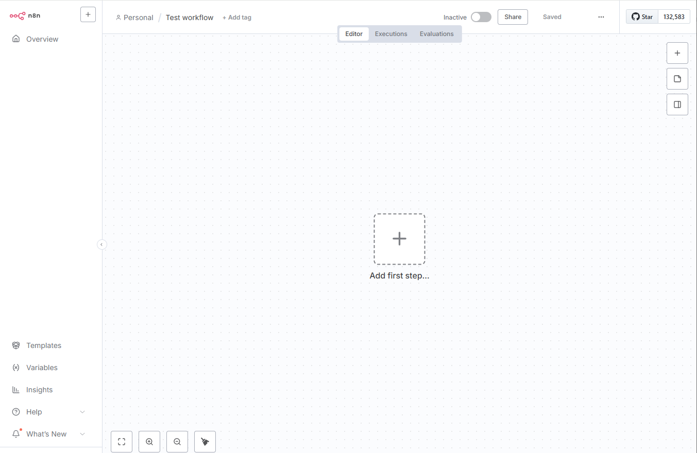

# Bienvenido a n8n Docs

Esta es la documentación de **n8n**, una herramienta de automatización de flujo de trabajo con licencia de código justo que combina capacidades de IA con automatización de procesos comerciales.

Abarca todo, desde la configuración hasta el uso y el desarrollo. Es un proyecto en desarrollo y todas las contribuciones son bienvenidas.

---

## Por dónde empezar

### 🏁 Guías de inicio rápido

Empiece a utilizar las guías de inicio rápido de n8n.

### 🚀 Pruébalo

Elige el n8n adecuado para ti: nube, npm, autohospedaje...

### 🔌 Explorar integraciones

Explora la biblioteca de integraciones de n8n.

### 🧠 Desarrollar funcionalidades de IA

n8n admite la creación de funciones y herramientas de inteligencia artificial.

---

## Acerca de n8n

**n8n** (pronunciado *n-ocho-n*) te ayuda a conectar cualquier aplicación con una API con cualquier otra y manipular sus datos con poco o ningún código.

- **Personalizable**: flujos de trabajo altamente flexibles y la opción de crear nodos personalizados.
- **Conveniente**: use npm o Docker para probar n8n, o la opción de alojamiento en la nube si desea que nos encarguemos de la infraestructura.
- **Centrado en la privacidad**: hospedaje propio de n8n para privacidad y seguridad.

