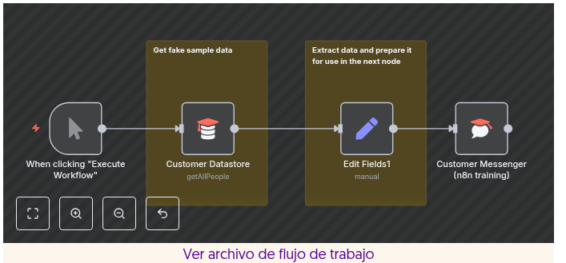

# 1 - Bienvenido a n8n Docs 
## Editado y subido a GitHub por Pablo Matías Monsalvo el 24/09/2025

Esta es la documentación de **n8n**, una herramienta de automatización de flujo de trabajo con licencia de código justo que combina capacidades de IA con automatización de procesos comerciales.

Abarca todo, desde la configuración hasta el uso y el desarrollo. Es un proyecto en desarrollo y todas las contribuciones son bienvenidas.

---

## Por dónde empezar

### Guías de inicio rápido

Empiece a utilizar las guías de inicio rápido de n8n.

### Pruébalo

Elige el n8n adecuado para ti: nube, npm, autohospedaje...

### Opciones

Explorar integraciones

Explora la biblioteca de integraciones de n8n.

Encuentra tus aplicaciones

### Desarrollar funcionalidades de IA

n8n admite la creación de funciones y herramientas de inteligencia artificial.

---

## Acerca de n8n

**n8n** (pronunciado *n-ocho-n*) te ayuda a conectar cualquier aplicación con una API con cualquier otra y manipular sus datos con poco o ningún código.

- **Personalizable**: flujos de trabajo altamente flexibles y la opción de crear nodos personalizados.
- **Conveniente**: use npm o Docker para probar n8n, o la opción de alojamiento en la nube si desea que nos encarguemos de la infraestructura.
- **Centrado en la privacidad**: hospedaje propio de n8n para privacidad y seguridad.

----------

# 2- Ruta de aprendizaje

Esta guía describe una serie de tutoriales y recursos diseñados para ayudarle a comenzar a utilizar **n8n**.

No es necesario completar todos los elementos de la lista para empezar a usar n8n. Úselo como referencia para navegar a las secciones más relevantes de la documentación y otros recursos según sus necesidades.

---

## Únete a la comunidad

n8n cuenta con una comunidad activa donde puedes obtener y ofrecer ayuda. Conéctate, comparte y aprende con otros usuarios de n8n:

- Haga preguntas y solicite funciones en el **[Foro de la comunidad](https://community.n8n.io)**.
- Informar errores y contribuir en **[GitHub](https://github.com/n8n-io/n8n)**.

---

## Configura tu n8n

Si aún no tienes una cuenta, regístrate para una prueba gratuita en **n8n Cloud** o instala la edición comunitaria de n8n con **Docker** (recomendado) o **npm**. Consulta *Elige tu n8n* para más información.

---

## Pruébalo

Comience con las guías de inicio rápido que lo ayudarán a comenzar a crear flujos de trabajo básicos:

- Un inicio rápido muy rápido
- Una introducción más larga
- Cree un flujo de trabajo de IA en n8n

---

## Cursos estructurados

n8n ofrece dos conjuntos de cursos:

### Cursos en vídeo

Aprenda conceptos clave y características de n8n, mientras crea ejemplos sobre la marcha:

- El curso para principiantes cubre los conceptos básicos de n8n.
- El curso avanzado cubre flujos de trabajo más complejos, nodos más técnicos y funciones empresariales.

### Cursos de texto

Crea flujos de trabajo más complejos mientras aprendes conceptos clave. Consigue una insignia y un avatar en tu perfil de comunidad:

- Nivel 1: Curso para principiantes
- Nivel 2: Curso Intermedio

---

## n8n autohospedado

Explora diversas opciones de autoalojamiento en n8n. Si no sabes por dónde empezar, estas son dos opciones populares:

- Alojamiento de n8n en DigitalOcean
- Alojamiento de n8n en Amazon Web Services

---

## Construir un nodo

Si no encuentras un nodo para una aplicación o servicio específico, puedes crear uno tú mismo y compartirlo con la comunidad. Consulta lo que otros han creado en el sitio web de [npm](https://www.npmjs.com/search?q=n8n-nodes).

- Construir un nodo de estilo declarativo
- Aprende a construir tus propios nodos n8n (Video de YouTube)

---

## Mantente actualizado

- Siga las nuevas funciones y correcciones de errores en las **Notas de la versión**.
- Sigue a n8n en las redes sociales: [Twitter/X](https://twitter.com/n8n_io), [Discord](https://discord.gg/n8n), [LinkedIn](https://www.linkedin.com/company/n8n-io), [YouTube](https://www.youtube.com/c/n8n-io).

-----------

# 3- Elige tu n8n

Esta sección contiene información sobre la gama de plataformas, planes de precios y licencias de **n8n**.

---

## Plataformas

Hay diferentes formas de configurar n8n dependiendo de cómo pretendas usarlo:

- **n8n Cloud**: solución alojada, no es necesario instalar nada.
- **Autohospedaje**: método recomendado para producción o casos de uso personalizados.
- **npm**
- **Docker**
- **Guías de configuración de servidores** para plataformas populares
- **Integrar**: n8n te permite usar n8n con marca blanca e integrarlo en tu propio producto. Contacta con n8n en el sitio web de Embed para consultar precios y soporte.

---

## Requisitos previos de conocimiento para el autoalojamiento

El autohospedaje de n8n requiere conocimientos técnicos, incluidos:

- Configuración y configuración de servidores y contenedores
- Gestión de recursos de aplicaciones y escalado
- Protección de servidores y aplicaciones

### Configurando n8n

n8n recomienda el autoalojamiento para usuarios expertos. Los errores pueden provocar pérdida de datos, problemas de seguridad y tiempos de inactividad. Si no tiene experiencia en la gestión de servidores, n8n recomienda **n8n Cloud**.

---

## Licencias

La **Licencia de Uso Sostenible** de n8n y la **Licencia Empresarial** de n8n se basan en el modelo de código justo.

Para obtener una explicación detallada de la licencia, consulte *Licencia de Uso Sostenible*.

---

## Versiones gratuitas

n8n ofrece las siguientes opciones gratuitas:

- Una prueba gratuita de Cloud
- Una edición comunitaria gratuita y autoalojada para usuarios autoalojados

---

## Versiones de pago

n8n tiene dos versiones de pago:

- **n8n Cloud**: elija entre una variedad de planes pagos que se adapten a sus necesidades de uso y funciones.
- **Autohospedado**: existen versiones tanto gratuitas como de pago.

Para conocer detalles de los planes de nube y datos de contacto para Enterprise Self-hosted, consulte *Precios* en el sitio web de n8n.

------------

# 4- Pruébalo

La mejor manera de aprender **n8n** es usar nuestros tutoriales para familiarizarse con la interfaz de usuario y los diferentes tipos de nodos e integraciones disponibles. Aquí tienes una selección de material para empezar:

- ¿Buscas una introducción rápida? Consulta el tutorial **"Primer flujo de trabajo"**.
- ¿Te interesa saber qué puedes hacer con la IA? Descubre cómo **crear un agente de chat con IA con n8n**.
- ¿Preferís trabajar con ejemplos extensos? Quizás estos **cursos** sean para vos.

----------

# 5- El inicio rápido muy rápido

Esta guía de inicio rápido te ayuda a empezar a usar **n8n** lo antes posible. Te permite probar la interfaz de usuario e introduce dos funciones clave: **plantillas de flujo de trabajo** y **expresiones**. No incluye explicaciones detalladas ni profundiza en los conceptos.

---

## En este tutorial, aprenderás lo siguiente:

- Cargar un flujo de trabajo desde la biblioteca de plantillas de flujo de trabajo
- Agregar un nodo y configurarlo usando expresiones
- Ejecutar tu primer flujo de trabajo

---

## Paso uno: Abrir una plantilla de flujo de trabajo y registrarse en n8n Cloud

n8n proporciona una plantilla de inicio rápido que utiliza nodos de entrenamiento. Puede usarse para trabajar con datos falsos y evitar la configuración de credenciales.

Esta guía utiliza **n8n Cloud**. Hay una prueba gratuita disponible para nuevos usuarios.

1. Ir a **Plantillas | Inicio rápido muy rápido**
2. Seleccionar **Usar gratis** para ver las opciones de uso de la plantilla
3. Seleccionar **Comenzar gratis con n8n Cloud** para registrarse en una nueva instancia

Este flujo de trabajo:

- Obtiene datos de ejemplo del nodo **Almacén de datos del cliente**
- Utiliza el nodo **Editar campos** para extraer únicamente los datos deseados y asignarlos a variables (nombre, ID y descripción del cliente)

Las partes individuales de un flujo de trabajo n8n se denominan **nodos**. Hacé doble clic en un nodo para explorar su configuración y cómo procesa los datos.

---

## Paso dos: Ejecutar el flujo de trabajo

Seleccioná **Ejecutar flujo de trabajo**. Esto ejecuta el flujo, cargando los datos del nodo **Almacén de datos del cliente** y luego transformándolos con **Editar campos**. Necesitás estos datos disponibles para trabajar con ellos en el siguiente paso.

---

## Paso tres: Agregar un nodo

Añadí un tercer nodo para enviar mensajes a cada cliente y compartir su descripción. Usá el nodo **Customer Messenger** para enviar mensajes a destinatarios falsos.

1. Seleccioná el icono de agregar nodo conector en el nodo **Editar campos**
2. Buscá **Customer Messenger**. n8n mostrará una lista de nodos coincidentes
3. Seleccioná **Customer Messenger (capacitación n8n)** para agregarlo al lienzo. n8n abrirá el nodo automáticamente

### Usar expresiones para mapear el ID del cliente y crear el mensaje

- En el panel **ENTRADA**, seleccioná la pestaña **Esquema**
- Arrastrá `Editar Campos1 > customer_id` al campo **ID de cliente** en la configuración del nodo
- Pasá el cursor sobre **Mensaje**, seleccioná la pestaña **Expresión** y luego el botón expandir para abrir el editor completo

Copia esta expresión en el editor:

```text
Hi {{ $json.customer_name }}. Your description is: {{ $json.customer_description }}

Cerrá el editor de expresiones y luego el nodo Customer Messenger haciendo clic fuera del nodo o seleccionando Volver al lienzo.

Seleccioná Ejecutar flujo de trabajo. n8n ejecutará el flujo completo.

El flujo de trabajo completo debería verse así: 